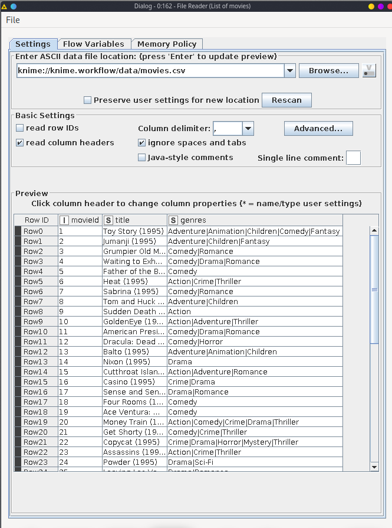
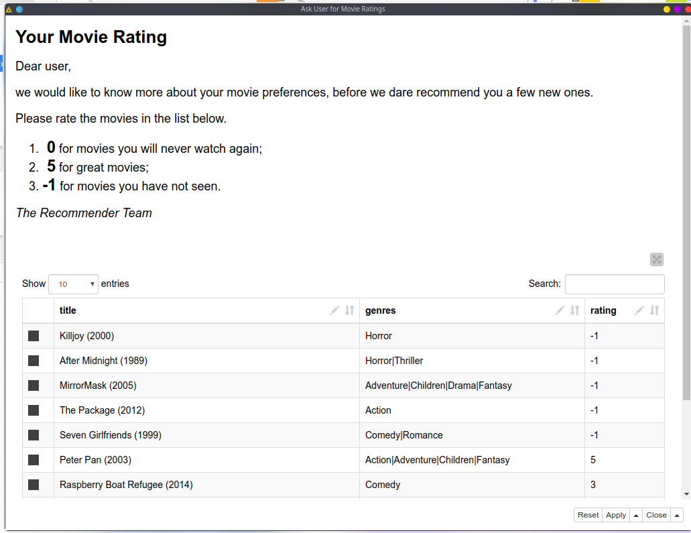
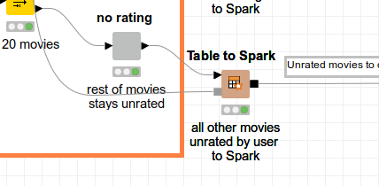
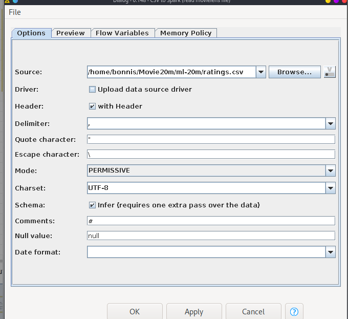
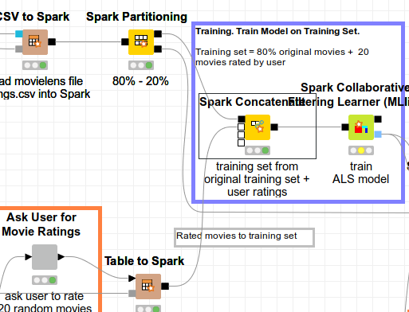
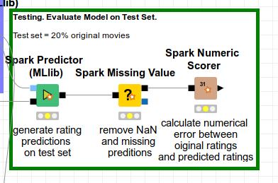
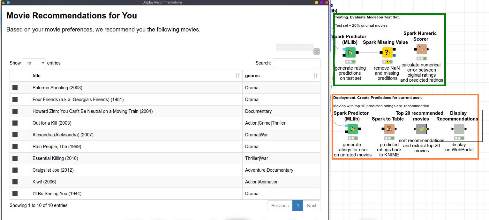
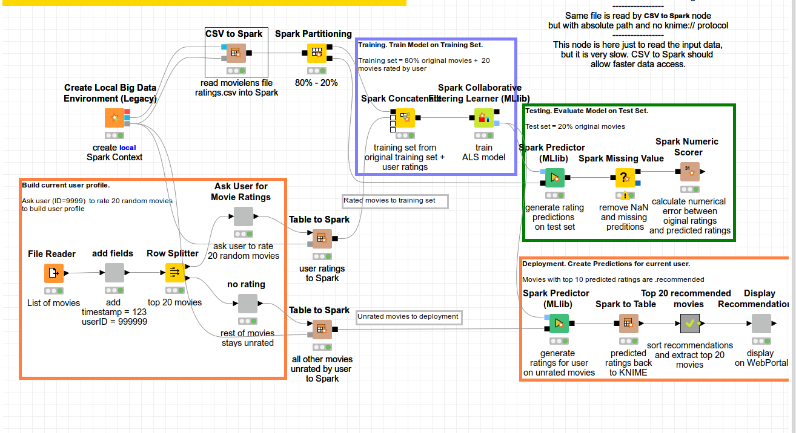
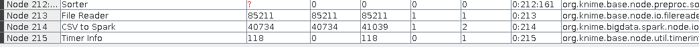

# Knime Movie Recommendation

## Business Understanding
In this workflow sample, we are given data of movie ratings. This data can be further processed for prediction. In this sample, we use the data to predict movie recommendation based on user ratings.

## Data Understanding
The data is consisted of six .csv files that act as tables that refer to each other using foreign keys. These tables with their each attributes are listed as follows :  
1. Tag
   - userId
   - movieId
   - tag
   - timestamp
2. Rating
   - userId
   - movieId
   - rating
   - timestamp
3. Movie
   - movieId
   - title
   - genres
4. Link
   - movieId
   - imdbId
   - tmbdId
5. Genome Score
   - movieId
   - tagId
   - relevance
6. Genome Tag
   - tagId
   - tag

## Data Preparation
1. Load the data using File Reader node.  

2. Add userid and timestamp field
3. Take 20 movie from the top of the table
4. Show the user a prompt to rate 20 movies  

5. Let the rest of the unrated data to be target of prediction  

6. Convert each of the table data to spark  
7. Read ratings to spark for training  

8. Partition the data to 80%/20% ratio of training and testing data

## Modeling
1. Concatenate the rated movies and the training data 
2. Train the model using Spark collaborative filtering learner node.  

## Evaluation
1. Predict the test data using the generated model
2. Remove missing values from the data
3. Score the prediction against the original data values  

## Deployment
1. Display the predicted movies  

## Final Workflow
  

## Time comparation between File reader and Csv to spark
To measure the execution time, we can create a timer info node and then create a file reader node and a csv to spark node that opens a same file. After the nodes are done executing, execute the timer info node to get the exact execution time of each node.
  
The result shows Csv to spark node takes approximately half the time of what the file reader node takes to complete.
